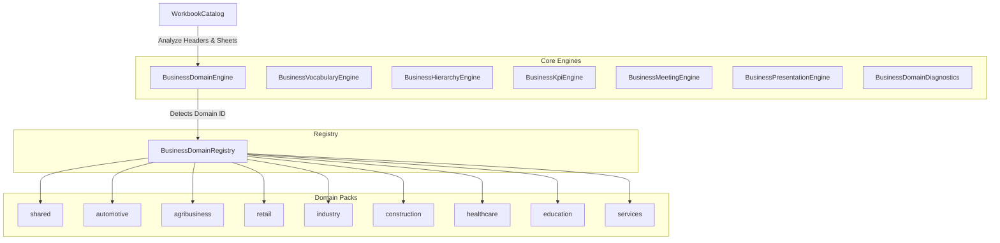

# Business Domain Framework Architecture

The **Business Domain Framework** is a decoupled, extensible metadata and analysis layer that models domain-specific business rules, hierarchies, vocabularies, KPIs, and dashboards across multiple industry sectors. It provides structural knowledge to other engines (such as the import, rule, and BI engines) without hardcoding segment logic inside them.

---

## 1. Architectural Design



The design comprises three main parts:
1. **Core Engines**: Stateless helper classes (`BusinessDomainEngine`, `BusinessVocabularyEngine`, etc.) that implement synonym lookup, hierarchy resolution, template queries, and automatic workbook domain detection.
2. **Registry**: A singleton memory registry (`BusinessDomainRegistry`) where domain packs register themselves upon package import.
3. **Domain Packs**: Compact modules containing domain metadata (manifest, vocabulary terms, hierarchy levels, KPIs, meeting order, presentation slides, rules, and header mappings).

---

## 2. Information Flow

1. **Workbook Loading**: A user uploads a spreadsheet. The `WorkbookEngine` parses it into a `WorkbookCatalog`.
2. **Domain Detection**: The `BusinessDomainEngine.detectDomain(workbook)` compares the cataloged columns, table headers, sheet names, and file name against all registered Domain Packs, generating a match score for each domain.
3. **Synonym Alignment**: If the detected domain is `automotive`, and a column contains `Vendedor`, the `BusinessVocabularyEngine` maps it to the canonical domain term `Consultor de vendas` using its synonym catalog.
4. **Analysis & Diagnostics**: `BusinessDomainDiagnostics` measures mapping coverage (how many workbook columns map directly to the domain vocabulary) and validates basic segment rules (e.g. F&I penetration limits or negative productivities).

---

## 3. How to Create and Add a New Domain Pack

To add a new segment (e.g. `energy`):

### Step 1: Create the Folder Structure
Under `src/core/business-domains/`, create a new folder `energy/` and populate the required files:

```bash
src/core/business-domains/energy/
  ├── index.ts
  ├── manifest.ts
  ├── vocabulary.ts
  ├── hierarchy.ts
  ├── kpis.ts
  ├── meeting.ts
  ├── presentation.ts
  ├── rules.ts
  └── mapping.ts
```

### Step 2: Implement Files

#### `manifest.ts`
```typescript
import { BusinessDomainManifest } from "../BusinessDomainTypes";
export const manifest: BusinessDomainManifest = {
  id: "energy",
  name: "Energia",
  description: "Metadados e KPIs para usinas solares, eólicas e distribuição de energia.",
  subdomains: ["solar", "eolica", "distribuicao"]
};
```

#### `vocabulary.ts`
```typescript
import { BusinessVocabulary } from "../BusinessDomainTypes";
export const vocabulary: BusinessVocabulary = {
  terms: [
    { term: "Usina", synonyms: ["Parque", "Geradora", "Unidade de Geração"] },
    { term: "Operador", synonyms: ["Técnico de Plantão", "Supervisor"] }
  ]
};
```

#### `hierarchy.ts`
```typescript
import { BusinessHierarchy } from "../BusinessDomainTypes";
export const hierarchy: BusinessHierarchy = {
  levels: ["Grupo", "Empresa", "Parque", "Inversor"]
};
```

#### `kpis.ts`
```typescript
import { BusinessKpi } from "../BusinessDomainTypes";
export const kpis: BusinessKpi[] = [
  { code: "ENERGY_GENERATION", name: "Geração de Energia", unit: "numeric" }
];
```

#### `meeting.ts`, `presentation.ts`, `rules.ts`, `mapping.ts`
Configure the meeting agenda, presentation layout, rules, and mappings. Export these objects from their respective files.

#### `index.ts`
Combine and export the `BusinessDomainPack`:
```typescript
import { BusinessDomainPack } from "../BusinessDomainTypes";
import { manifest } from "./manifest";
import { vocabulary } from "./vocabulary";
import { hierarchy } from "./hierarchy";
import { kpis } from "./kpis";
import { meeting } from "./meeting";
import { presentation } from "./presentation";
import { rules } from "./rules";
import { mapping } from "./mapping";

export const energyPack: BusinessDomainPack = {
  manifest,
  vocabulary,
  hierarchy,
  kpis,
  meeting,
  presentation,
  rules,
  mapping
};
export default energyPack;
```

### Step 3: Register the Pack
In the package entry point `src/core/business-domains/index.ts`, import your new pack and register it:

```typescript
import { energyPack } from "./energy";
businessDomainRegistry.register(energyPack);
```

---

## 4. Best Practices

- **Registry Isolation**: Do not hardcode domain IDs in the registry or core engines. All domains must behave identically through metadata definition.
- **Shared Concept Fallbacks**: Always query the `shared` pack for universal concepts (like `Receita`, `Margem`, `Grupo`, `Empresa`) if the specific segment pack does not define them.
- **Case and Whitespace Insensitivity**: When matching column headers and resolving synonyms, convert inputs to lowercase and trim spaces to prevent formatting mismatches.
- **No Mock or Fake Data**: Avoid generating fake names or static demo variables. Rely strictly on structural templates and validated workbook logs.
